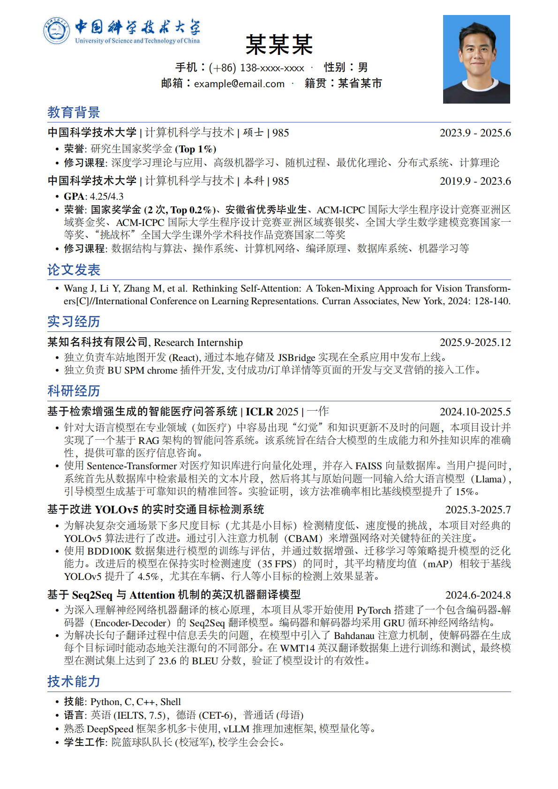

# USTC Resume LaTeX Template

[](README.md)
[](readme.md)
[](https://www.latex-project.org/)
[](https://www.ustc.edu.cn/)

A professional **University of Science and Technology of China (USTC)** resume LaTeX template designed specifically for students and alumni. This template supports both Chinese and English mixed typesetting, making it suitable for various job applications, academic applications, and scholarship applications.

---

**🔗 中文版本**: [查看中文文档](readme.md)

---

## 📋 Project Features

- ✨ **Professional & Elegant**: Clean academic style that highlights personal strengths
- 🎨 **Bilingual Support**: Perfect support for Chinese-English mixed typesetting with clear font rendering
- 📐 **Standard Format**: Complies with USTC resume specifications, suitable for various application scenarios
- 🚀 **Easy to Use**: Generate professional resume by simply modifying personal information
- 📱 **Responsive Design**: Automatically adapts to different printing and screen display needs

## 📸 Effect Preview



*Generated resume effect preview*

## 🚀 Quick Start

### 1. Requirements

- **LaTeX Compiler**: **XeLaTeX** or **LuaLaTeX** (recommended)
- **Font Support**: Template includes built-in Chinese font support
- **Recommended Editors**: TeXstudio, VS Code + LaTeX Workshop, USTC Overleaf (download ZIP and upload project directly)

### 2. Compilation Steps

```bash
# Compile with XeLaTeX (recommended)
xelatex resume.tex
```

**Note**: Due to the use of Chinese fonts, please use XeLaTeX or LuaLaTeX for compilation. Do not use traditional pdfLaTeX.

## 📁 Project Structure

```
USTC_Resume/
├── resume.tex          # Main file containing resume content
├── cls/
│   └── resume.cls      # Resume style class file
├── sty/
│   ├── linespacing_fix.sty      # Line spacing fix
│   └── zh_CN-Adobefonts_external.sty  # Chinese font support
├── fonts/              # Font directory (no manual handling required)
├── image/              # Image directory
│   ├── identification_photo.jpeg    # ID photo
│   └── logo.png                    # School logo
├── readme_image/
│   └── example.png                 # Example image
└── readme.md           # Chinese documentation
```

## 🖼️ Image Customization

### 1. Replace ID Photo

Replace your ID photo in `image/identification_photo.jpeg`. Supported formats:

- JPEG/JPG
- PNG
- PDF

### 2. Replace School Logo

To replace the school logo, place the new logo file in `image/logo.png`. Recommended size: 600x300 pixels.

## 📝 Resume Content Structure

The template includes the following main sections:

1. **Personal Information** - Name, contact details, etc.
2. **Education Background** - Bachelor's, Master's, PhD study experiences
3. **Publications** - Academic papers, conference papers, etc.
4. **Internship Experience** - Company internships, project experiences
5. **Research Experience** - Research projects, academic achievements
6. **Technical Skills** - Programming languages, tools, language abilities

## 📂 USTC LaTeX Website Usage

1. **Download Project**: Click "Code" → "Download ZIP" to download the complete project
2. **Upload to USTC LaTeX Website**:
   - Visit [USTC LaTeX Online Editor](https://latex.ustc.edu.cn/login)
   - Create a new project
   - Upload the downloaded ZIP file
3. **Compile t**
4. **READMEo Generate**: Compile directly on the website to generate PDF resume. Note: Select XeLaTeX as compiler

## 📋 Important Notes

1. **Compilation Environment**: Must use XeLaTeX or LuaLaTeX for compilation
2. **Font Issues**: If fonts are missing, ensure the fonts directory is fully downloaded
3. **Image Paths**: Place image files in the image directory
4. **Version Compatibility**: Recommended LaTeX distribution version 2020 or higher

## 🙏 Acknowledgments

- Thanks to USTC Academic Affairs Office for providing standard format specifications
- Thanks to the open source community for contributions to the LaTeX ecosystem: [hijiangtao/resume](https://github.com/hijiangtao/resume)
- Thanks to all students who use and provide feedback on this template

---

**Keywords**: USTC, University of Science and Technology of China, resume, CV, 求职, LaTeX, resume template, academic resume, job application, master resume, bachelor resume, research resume, internship resume
